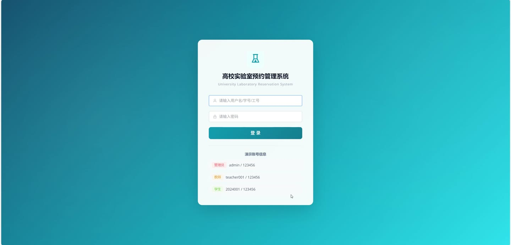
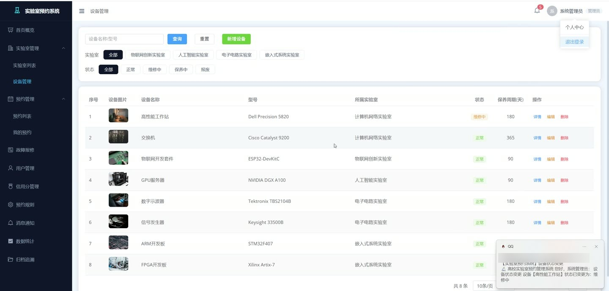
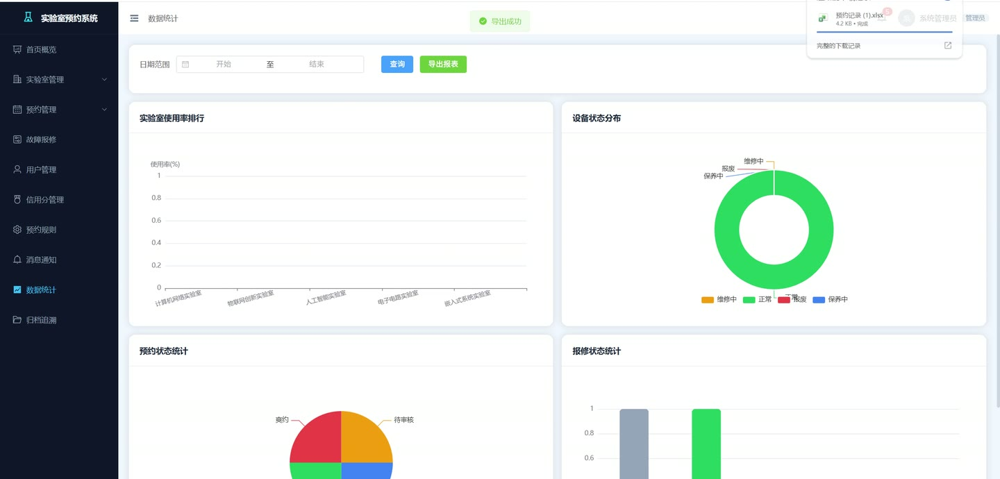
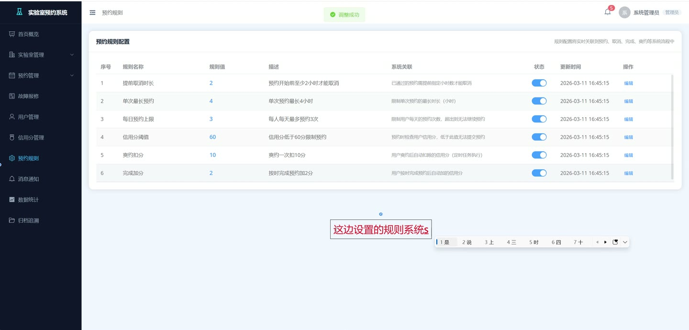
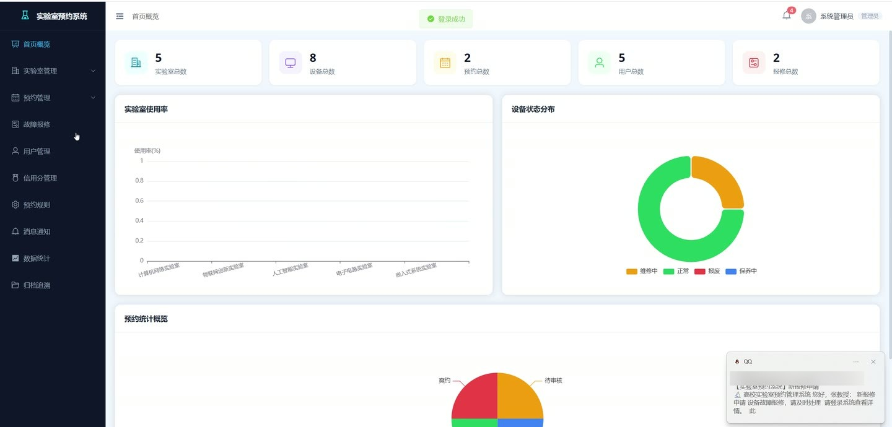
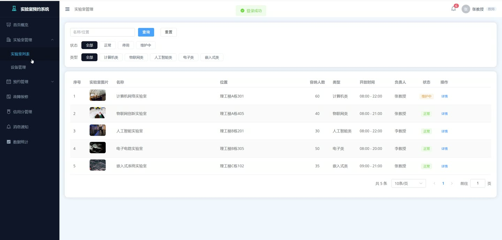

# (附文档)Springboot3+Vue3+MySQL 高校实验室预约管理系统

**技术栈**：Springboot3、Vue3、MySQL

### 系统简介

本系统是一套基于 Spring Boot 3 + Vue 3 + MySQL 的高校实验室预约管理平台，采用前后端分离架构，包含普通用户端、教师端、管理员端三个角色。系统提供实验室预约、设备管理、故障报修、信用分管理、通知消息、操作归档与追溯、数据统计与智能推荐等核心功能，实现对高校实验室资源的数字化、规范化管理。
 
### 核心功能
 
### 普通用户端

 
- 查看实验室列表（支持按名称/地点关键词搜索、按状态/类型筛选） 
- 提交预约申请（选择实验室、设备、日期、时段，填写用途说明） 
- 查看我的预约列表（支持按状态筛选：待审核/已通过/已拒绝/已完成/已取消） 
- 取消预约（仅限待审核或已通过状态的预约） 
- 完成预约（使用结束后标记为已完成） 
- 提交故障报修（选择实验室、设备，填写故障描述、紧急程度） 
- 查看我的报修记录（支持按处理状态筛选） 
- 二次报修（维修验收不合格时重新提交报修） 
- 查看我的通知消息（按类型筛选：系统通知/维护通知/审核通知） 
- 标记通知为已读（支持单条标记和全部标记已读） 
- 查看我的信用分记录（按时间倒序展示变动明细） 
- 修改个人密码（需验证旧密码） 
- 更新个人信息（修改姓名、邮箱、电话、头像等） 
- 查看预约推荐时段（基于历史使用率推荐低峰时段） 
- 检测预约冲突（提交前校验所选时段是否已被占用）
 
### 教师端

 
- 审核预约申请（通过/拒绝，填写审核意见） 
- 查看我负责的实验室列表 
- 查看实验室预约记录（按实验室、日期、状态筛选） 
- 查看实验室使用率统计（按日期范围统计已完成预约数） 
- 接收实验室/设备状态变更通知 
- 查看系统通知与维护通知
 
### 管理员端

 
- 用户管理：新增用户、修改用户信息、删除用户、重置密码（默认123456） 
- 用户分页查询（支持按用户名/姓名关键词搜索、按角色筛选） 
- Excel导入用户（下载模板、批量导入学生/教师账号） 
- 实验室管理：新增、修改、删除实验室（含名称、位置、类型、容量、负责人、状态） 
- 设备管理：新增、修改、删除设备（含名称、型号、规格、所属实验室、状态） 
- 最终审批预约（管理员对教师审核后的预约进行终审，通过/拒绝） 
- 故障报修派单（选择维修人员、填写联系方式） 
- 完成维修（填写维修备注） 
- 驳回报修（填写驳回原因） 
- 验收确认（维修完成后确认验收） 
- 维修人员管理：新增、修改、删除维修人员（姓名、电话、擅长领域） 
- 预约规则管理：查看和修改预约规则（最大预约天数、可预约时段等） 
- 发送系统通知（支持发送给全部用户/所有学生/所有教师/指定用户） 
- 查看所有通知（按类型/关键词搜索，查看接收人姓名） 
- 删除通知 
- 操作日志查询（按操作内容/用户名关键词、日期范围搜索） 
- 操作归档与追溯：预约归档、报修维护归档、维护保养归档、操作日志归档（均支持多条件筛选） 
- 数据统计概览（用户数、实验室数、设备数、预约数、报修数） 
- 实验室使用率统计（按日期范围统计各实验室已完成预约数和总预约数） 
- 设备状态分布统计（正常/维修中/保养中/报废数量） 
- 预约统计（按日期范围统计各状态预约数量） 
- 智能推荐：低使用率时段推荐、空闲设备推荐、最佳预约时段推荐 
- 导出预约记录（Excel格式，支持按日期范围筛选） 
- 信用分管理：查看用户信用分记录、手动调整信用分（加/减分，填写原因） 
- 文件上传（本地上传，返回访问URL）
 
### 技术栈

 后端框架Spring Boot 3.x ORMMyBatis-Plus 权限认证Spring Security + JWT 数据库MySQL 前端框架Vue 3 状态管理Vuex / Pinia 构建工具Vite 报表导出EasyExcel 邮件服务JavaMail (异步发送) 文件上传本地上传
 
### 交付内容

 
- 后端完整源码 
- 前端完整源码 
- 数据库初始化脚本 
- 万字文档

## 界面展示

---

## 获取完整源码 + 万字文档

本仓库为项目介绍页。**完整前后端源码、数据库初始化脚本、万字项目文档**，请访问 [codekk.top](http://codekk.top) 获取。

可作课程设计 / 毕业设计参考，支持远程部署调试。